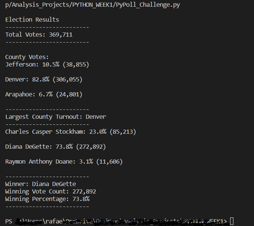
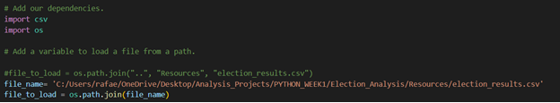
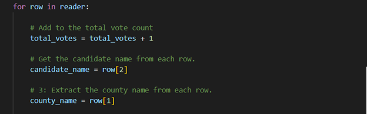

# Overview of Election Audit

## 1. The Purpose:
The purpose of this audit is to collaborate with a Colorado Board of Elections employee to obtain the results of recent congressional elections. He must obtain the necessary information from the database with all the votes and determine the winner, number of votes, county with the largest number of votes, percentage, and final number of votes for each candidate. 

## 2.	Election-Audit Results: 
This congressional election obtained 369.711 votes from the three different county’s (Jefferson, Denver, Arapahoe) registered Denver like the county largest number of votes. The candidate Diana DeGette won the elections with 272.892 votes this represents 73.8% of all votes, following with the candidate Chares Casper Stockham in second place with 85.213 of votes that represented 23.0% of all votes and in the third place the candidate Raymon Anthony Doane got 11.606 votes for a 3.1 percent of votes. 

  
 
## 3.	Election-Audit Summary:

This code can be used for another elections, first we could change the database for another one, first path the csv file for charge the information in the code. Save the database in our computer, copy the route of access and use it to change the name in the file_name variable, the route of access should be look like ‘c:/new_database.csv’

 
Also, if the new data have extra columns or the information is in different columns, we can modify the for loop for obtain the exact information we are looking for. The database we are using have the "ID" for the first column, "County" for the second and the "Candidate’s name" for the third. For example is the County data were in third column the code for got it in the loop should be change from county_name=row[1] to county_name=row[2], remember the loop start in 0, so "ID" in the column 1 should be 0, "County" is in the column 2 so it should be 1 and "Candidate’s name" column 3 is 2.
 

